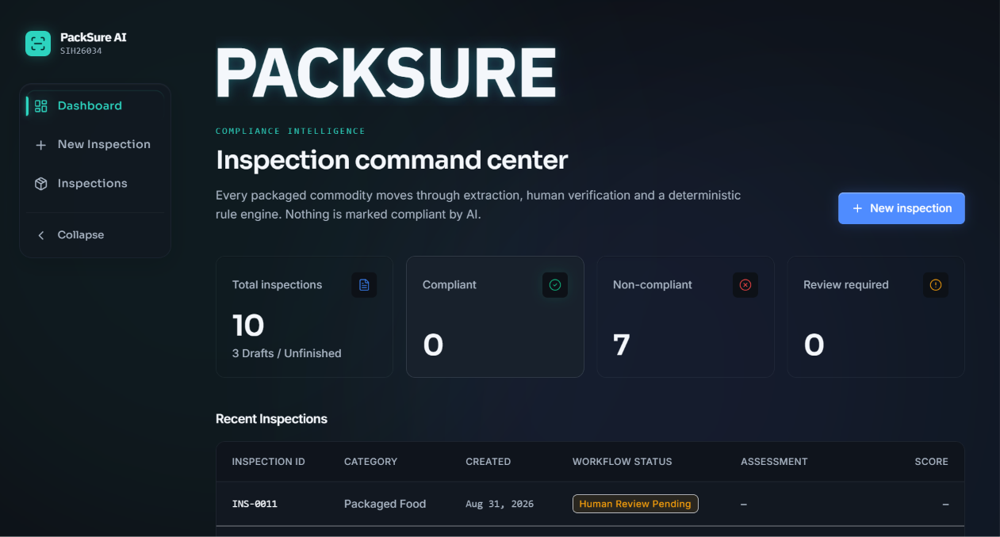
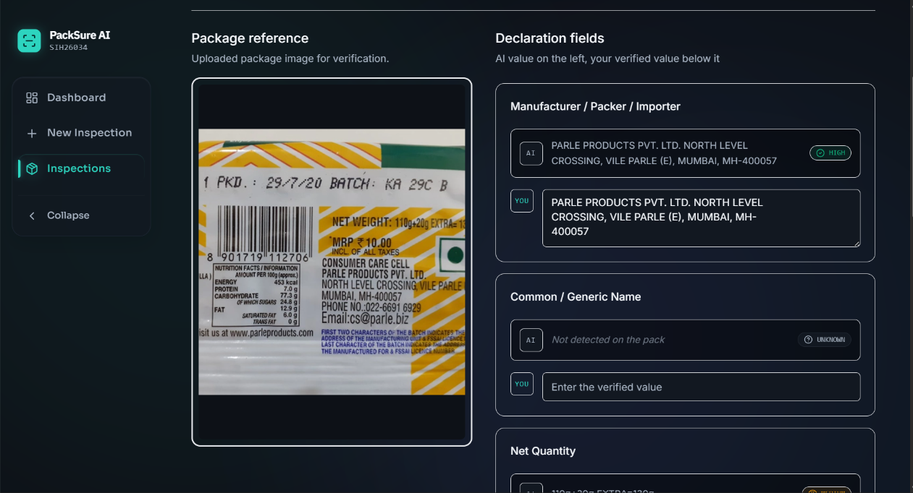
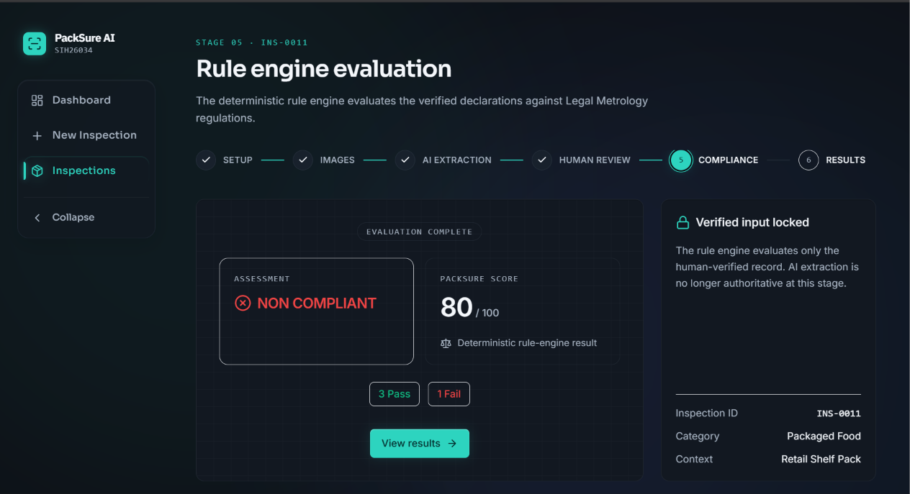
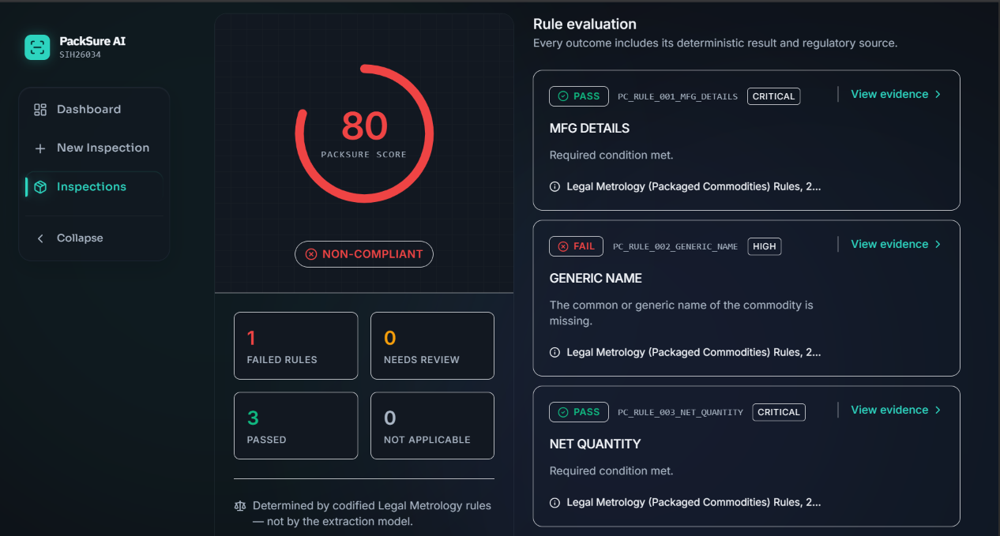
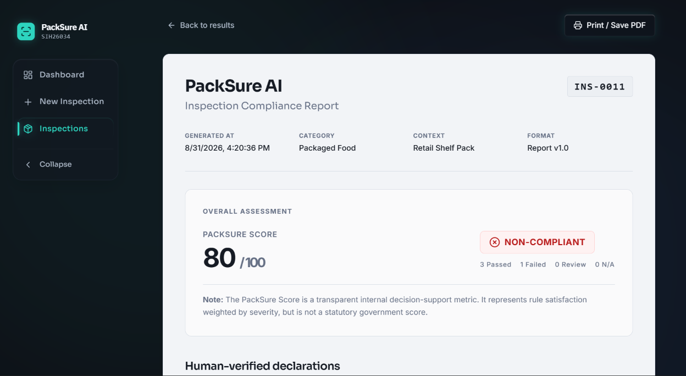
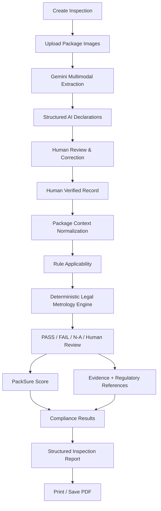
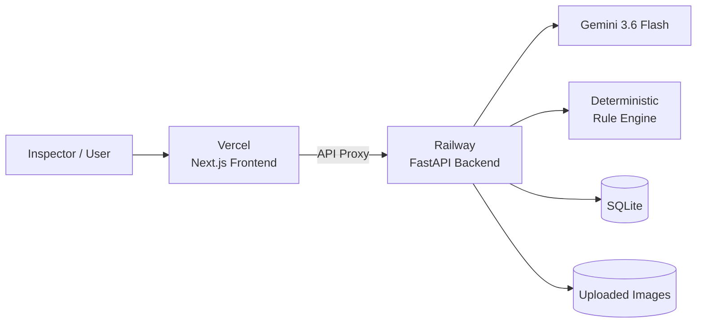

# 📦 PackSure AI

### ⚖️ Intelligent Packaged Commodity Compliance Inspector

**🏆 Smart India Hackathon 2026 — Problem Statement SIH26034**

PackSure AI is an AI-assisted packaged commodity compliance inspection system built around the **Legal Metrology (Packaged Commodities) Rules, 2011**.

It converts package images into structured declarations, allows a human reviewer to verify or correct those declarations, and then evaluates the verified record using a **deterministic Legal Metrology rule engine**.

> 🤖 **AI assists with extraction.**  
> 👤 **Humans verify the declarations.**  
> ⚖️ **Deterministic rules decide compliance.**

---

## 🚀 Live Deployment

### 🌐 Web Application

**PackSure AI**

https://packsure-ai-sigma.vercel.app

### ⚙️ Backend API / Swagger

https://sih26034-production.up.railway.app/docs

---

# 🎯 Problem Statement

**SIH26034**

Packaged commodity inspections require mandatory declarations to be identified and checked against applicable Legal Metrology requirements.

Traditional inspection can involve:

- manually reading package labels
- identifying required declarations
- interpreting package context
- checking regulatory requirements
- recording violations
- preparing inspection reports

This can become time-consuming and difficult to standardize.

PackSure AI provides a structured digital inspection workflow while keeping **human verification and deterministic rule evaluation at the centre of the compliance decision**.

---

# 💡 Our Solution

PackSure follows a strict separation of responsibilities:

```text
📷 Package Images
        ↓
🤖 AI Declaration Extraction
        ↓
👤 Human Review & Correction
        ↓
✅ Human-Verified Record
        ↓
🧭 Applicability Normalization
        ↓
⚖️ Deterministic Legal Metrology Rules
        ↓
📊 PackSure Score + Assessment
        ↓
🔍 Evidence & Regulatory References
        ↓
📄 Structured Inspection Report
```

The AI model **does not determine whether a package is legally compliant**.

Its role is limited to extracting declarations visible on package images.

The compliance decision is generated only after human verification using codified deterministic rules.

---

# 🖥️ Product Preview

## 📊 Inspection Command Center



The dashboard provides authoritative inspection statistics, recent inspection activity and direct access to new inspections.

---

## 👤 AI Extraction + Human Verification



AI-generated values remain visible alongside the reviewer-controlled values.

The reviewer can:

- inspect the original package image
- compare extracted text
- correct AI mistakes
- preserve missing values
- create the final human-verified declaration record

---

## ⚖️ Deterministic Rule Engine



After human verification, PackSure locks the verified declaration record and runs deterministic Legal Metrology rules.

The AI output is no longer authoritative at this stage.

---

## 🔎 Evidence-backed Compliance Results



Each evaluated rule contains:

- deterministic status
- rule identifier
- severity
- explanation
- regulatory source
- evidence

---

## 📄 Inspection Compliance Report



The final report includes the PackSure Score, assessment, verified declarations, rule evaluations and inspection metadata.

It can be exported using **Print / Save PDF**.

---

# ✨ Why PackSure AI?

A naive AI compliance system could work like this:

```text
Upload Package
      ↓
Ask AI:
"Is this legally compliant?"
      ↓
AI generates an answer
```

PackSure intentionally **does not use this architecture**.

Instead:

```text
AI Extraction
      ↓
Human Verification
      ↓
Deterministic Rule Engine
      ↓
Traceable Assessment
```

This improves:

- reproducibility
- auditability
- transparency
- legal traceability
- human oversight
- explainability

---

# 🤖 AI Responsibility

Gemini is used only for **multimodal declaration extraction**.

The extraction layer can identify fields such as:

- Manufacturer / Packer / Importer
- Common / Generic Name
- Net Quantity
- MRP
- Month / Year of Manufacture
- Consumer Care Details
- Country of Origin

The extraction output can preserve:

- normalized value
- raw text
- confidence level
- source-image references

Confidence states include:

```text
HIGH
MEDIUM
LOW
UNKNOWN
```

AI does **not**:

- decide PASS / FAIL
- invent Legal Metrology requirements
- determine final compliance
- override the human reviewer
- generate legal certification

---

# 👤 Human Verification

PackSure maintains two distinct records:

```text
extracted_data
```

AI-generated declaration information.

and:

```text
verified_data
```

Human-confirmed information.

The original extraction is preserved even if the reviewer modifies the value.

Compliance evaluation runs exclusively on:

```text
verified_data
```

This makes the difference between **machine extraction** and **human judgment** traceable.

---

# ⚖️ Deterministic Compliance Engine

Once verification is complete, PackSure evaluates codified rules.

Each rule can return:

```text
PASS
FAIL
NOT_APPLICABLE
REQUIRES_HUMAN_REVIEW
```

The deterministic engine is responsible for:

- applicability
- declaration presence checks
- compliance status
- severity
- evidence
- regulatory references
- scoring contribution

---

# 📚 Current Legal Metrology Scope

PackSure currently implements a focused subset of the:

**Legal Metrology (Packaged Commodities) Rules, 2011**

primarily around Rule 6 declarations.

| Rule ID | Declaration | Reference | Severity |
|---|---|---|---|
| `PC_RULE_001_MFG_DETAILS` | Manufacturer / Packer / Importer | Rule 6(1)(a) | Critical |
| `PC_RULE_002_GENERIC_NAME` | Common / Generic Name | Rule 6(1)(b) | High |
| `PC_RULE_003_NET_QUANTITY` | Net Quantity | Rule 6(1)(c) | Critical |
| `PC_RULE_004_MRP` | Maximum Retail Price | Rule 6(1)(e) | Critical |

Applicability can depend on package context and category.

If applicability cannot be determined safely, PackSure can return:

```text
REQUIRES_HUMAN_REVIEW
```

rather than forcing a legal conclusion.

> ⚠️ The current prototype implements a defined subset of Legal Metrology packaged-commodity requirements. It does not claim complete coverage of Indian packaging legislation.

---

# 📊 PackSure Score

PackSure generates a transparent internal decision-support score from applicable deterministic rules.

Current internal weights:

| Severity | Weight |
|---|---:|
| Critical | 4 |
| High | 3 |
| Medium | 2 |
| Low | 1 |

Conceptually:

```text
        Earned applicable rule weight
Score = ─────────────────────────────── × 100
        Total applicable rule weight
```

Rules marked:

```text
NOT_APPLICABLE
```

are excluded from the denominator.

Rules requiring human review keep the assessment provisional.

---

# 🧠 Assessment Logic

```text
Any FAIL
     ↓
NON_COMPLIANT
```

```text
No FAIL
+ REQUIRES_HUMAN_REVIEW
     ↓
REVIEW_REQUIRED
```

```text
All applicable rules PASS
     ↓
COMPLIANT
```

> 📌 The PackSure Score is an internal decision-support metric. It is **not a statutory government score**.

---

# 🔄 End-to-End Workflow



---

# 🏗️ System Architecture



### Production request path

```text
Desktop / Mobile / Judge Device
              ↓
packsure-ai-sigma.vercel.app
              ↓
         Vercel Proxy
          ↙       ↘
       /api      /media
          ↓       ↓
       Railway Backend
              ↓
    ┌─────────┴─────────┐
    │                   │
 Gemini API       Persistent /data
                  ├── packsure.db
                  └── local_storage/
```

The Vercel proxy also prevents client devices from needing direct access to the Railway hostname.

---

# 🔁 Inspection Lifecycle

```text
CREATED
   ↓
IMAGES_UPLOADED
   ↓
EXTRACTION_PENDING
   ↓
EXTRACTION_COMPLETED
   ↓
HUMAN_REVIEW_PENDING
   ↓
HUMAN_VERIFIED
   ↓
COMPLIANCE_EVALUATED
   ↓
COMPLETED
```

PackSure also handles draft and failure states.

Completed inspections are treated as historical inspection records rather than editable drafts.

---

# 📄 Structured Inspection Report

The report contains:

- inspection ID
- generated timestamp
- product category
- package context
- PackSure Score
- overall assessment
- verified declarations
- rule evaluation results
- severity
- evidence
- regulatory references
- summary counts
- package reference
- disclaimer

Reports are rendered dynamically from the stored verified inspection state.

No AI extraction is rerun when generating a report.

---

# 📈 Dashboard

PackSure exposes an authoritative backend statistics endpoint:

```http
GET /api/dashboard/stats
```

The dashboard shows:

- total inspections
- compliant inspections
- non-compliant inspections
- review-required inspections
- unfinished drafts
- recent inspection records

The frontend does not derive compliance statistics by scanning all inspections locally.

---

# 🛠️ Technology Stack

## 🎨 Frontend

- Next.js 14
- React 18
- TypeScript
- Tailwind CSS
- Framer Motion
- Lucide React

### Typography

- IBM Plex Sans — PackSure branding
- Sora — headings / navigation
- Inter — application UI
- Monospace — inspection IDs / technical metadata

---

## ⚙️ Backend

- Python 3.12
- FastAPI
- SQLAlchemy
- SQLite
- Pydantic
- Uvicorn
- Pytest

---

## 🤖 AI

- Gemini 3.6 Flash
- Google GenAI SDK
- multimodal image understanding
- structured schema extraction

---

## ☁️ Deployment

### Frontend

**Vercel**

```text
frontend/
```

### Backend

**Railway**

```text
backend/
```

### Persistent Railway Volume

```text
/data
```

Database:

```text
/data/packsure.db
```

Uploaded images:

```text
/data/local_storage/
```

---

# 📁 Repository Structure

```text
SIH26034/
│
├── frontend/
│   ├── src/
│   │   ├── app/
│   │   ├── components/
│   │   ├── lib/
│   │   └── types/
│   │
│   ├── next.config.mjs
│   └── package.json
│
├── backend/
│   ├── app/
│   │   ├── api/
│   │   ├── core/
│   │   ├── models/
│   │   ├── rules/
│   │   ├── schemas/
│   │   └── services/
│   │       ├── compliance/
│   │       └── extraction/
│   │
│   ├── data/
│   │   └── legal_metrology/
│   │
│   ├── tests/
│   └── requirements.txt
│
├── docs/
│   ├── screenshots/
│   └── legal-metrology-source-inventory.md
│
├── scripts/
│
└── README.md
```

---

# 🔌 Core API

## Dashboard

```http
GET /api/dashboard/stats
```

## Inspections

```http
POST   /api/inspections/
GET    /api/inspections/
GET    /api/inspections/{id}
PATCH  /api/inspections/{id}
DELETE /api/inspections/{id}
```

## Package Images

```http
POST /api/inspections/{id}/images
```

## AI Extraction

```http
POST /api/inspections/{id}/extract
```

## Human Review

```http
GET  /api/inspections/{id}/review
POST /api/inspections/{id}/review
```

## Compliance Evaluation

```http
POST /api/inspections/{id}/evaluate
```

## Inspection Report

```http
GET /api/inspections/{id}/report
```

## Health

```http
GET /health
```

---

# 💻 Running Locally

## 1️⃣ Clone Repository

```bash
git clone https://github.com/SuperVOID-og/SIH26034.git
cd SIH26034
```

---

## 2️⃣ Backend Setup

```powershell
cd backend

python -m venv venv

.\venv\Scripts\Activate.ps1

pip install -r requirements.txt
```

Create:

```text
backend/.env
```

Example:

```env
GEMINI_API_KEY=your_gemini_api_key
GEMINI_MODEL=gemini-3.6-flash
DATABASE_URL=sqlite:///./packsure.db
CORS_ORIGINS=http://localhost:3000
```

Start backend:

```powershell
uvicorn app.main:app --reload
```

Backend:

```text
http://localhost:8000
```

Swagger:

```text
http://localhost:8000/docs
```

---

## 3️⃣ Frontend Setup

```powershell
cd frontend

npm install
```

Create:

```text
frontend/.env.local
```

Add:

```env
NEXT_PUBLIC_API_BASE_URL=http://localhost:8000
```

Start frontend:

```powershell
npm run dev
```

Open:

```text
http://localhost:3000
```

---

# 🧪 Testing

Backend tests:

```powershell
cd backend

.\venv\Scripts\Activate.ps1

pytest
```

Validated backend baseline:

```text
97 tests passed
```

Frontend validation:

```powershell
cd frontend

npx tsc --noEmit

npm run build
```

The production build and backend test suite were validated before deployment.

---

# ☁️ Production Configuration

## Railway

Backend root directory:

```text
/backend
```

Runtime variables:

```env
DATABASE_URL=sqlite:////data/packsure.db

LOCAL_STORAGE_DIR=/data/local_storage

GEMINI_MODEL=gemini-3.6-flash

GEMINI_API_KEY=<secret>

CORS_ORIGINS=http://localhost:3000,https://packsure-ai-sigma.vercel.app
```

Persistent volume:

```text
/data
```

Production start command:

```bash
uvicorn app.main:app --host 0.0.0.0 --port $PORT --proxy-headers --forwarded-allow-ips="*"
```

---

## Vercel

Frontend root directory:

```text
frontend
```

Framework:

```text
Next.js
```

Production API base:

```env
NEXT_PUBLIC_API_BASE_URL=https://packsure-ai-sigma.vercel.app
```

Vercel rewrites proxy:

```text
/api/*
```

and:

```text
/media/*
```

to the Railway backend.

---

# 🔐 Security & Data Handling

PackSure keeps secrets server-side.

The frontend does **not** receive:

- Gemini API keys
- server credentials
- database credentials
- private backend configuration

The Gemini key exists only in backend environment variables.

Uploaded package images and SQLite runtime data are stored on the Railway persistent volume.

Environment files should never be committed to Git.

---

# 🧭 Design Principles

### 👤 Human oversight

AI-generated declarations remain reviewable and correctable.

### ⚖️ Deterministic legal decisions

AI cannot issue final PASS / FAIL compliance judgments.

### 🔍 Traceability

Rule outcomes preserve regulatory references and evidence.

### ❓ Honest uncertainty

PackSure can explicitly require human review instead of inventing an answer.

### 🧾 Auditability

Original AI extraction and verified declarations remain separate.

### 📌 Controlled legal claims

PackSure presents itself as decision-support software rather than statutory certification.

---

# ⚠️ Current Limitations

The current prototype:

- implements a focused subset of Legal Metrology rules
- depends on package-image quality for extraction
- requires human verification before compliance evaluation
- does not claim complete Indian packaging-law coverage
- does not yet implement full authentication / RBAC
- currently uses SQLite
- does not currently implement inspection revisions
- does not replace statutory Legal Metrology inspection

These limitations are intentionally documented rather than hidden.

---

# 🔮 Future Scope

Possible future extensions:

- expanded Legal Metrology rule coverage
- regulatory version management
- authentication
- role-based access control
- inspector organizations
- PostgreSQL
- object storage
- bulk inspection
- barcode / QR identification
- multilingual package extraction
- advanced package-image validation
- analytics dashboards
- regulation administration
- inspection revisions
- reinspection history
- automated rule-version migration

A future reinspection system should create a **new linked revision** rather than overwrite a historical completed inspection.

---

# 🌟 What Makes PackSure Different?

PackSure is not:

```text
📷 Upload package
      ↓
🤖 Ask AI if compliant
      ↓
⚠️ Trust generated answer
```

PackSure is:

```text
📷 Package Image
      ↓
🤖 AI Extraction
      ↓
👤 Human Verification
      ↓
⚖️ Deterministic Legal Rules
      ↓
📊 Transparent Score
      ↓
🔍 Evidence-backed Assessment
      ↓
📄 Traceable Report
```

That separation between **AI perception** and **deterministic compliance logic** is the core engineering principle behind PackSure.

---

# 📌 Disclaimer

> **PackSure provides traceable decision-support based on codified Legal Metrology rules and human-verified package declarations. It does not constitute statutory inspection, legal certification, or legal advice.**

---

# 🏆 Smart India Hackathon 2026

**Problem Statement:** SIH26034  
**Project:** PackSure AI  
**Category:** Software

### 📦 Compliance intelligence with human oversight and deterministic rules.
